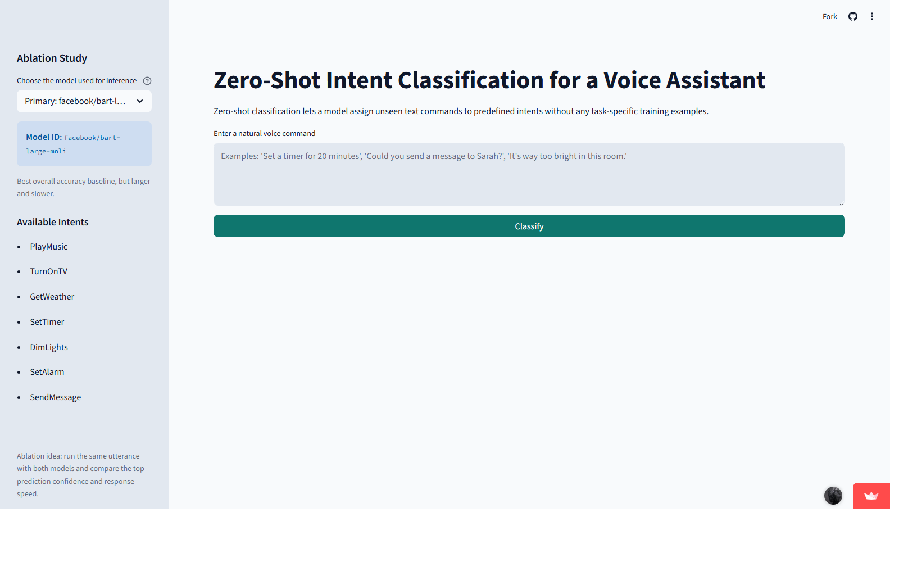

# Zero-Shot Intent Classification for a Voice Assistant

[](https://zero-shot-intent-classification-for-a-voice-assistant.streamlit.app)

This project implements **Task 13: Zero-Shot Intent Classification for a Voice Assistant** as a Streamlit web app using Hugging Face Transformers. The system maps unseen natural-language commands to one of seven smart-home intents **without task-specific training** by using the `zero-shot-classification` pipeline.

## Live Demo

- Streamlit App: [zero-shot-intent-classification-for-a-voice-assistant.streamlit.app](https://zero-shot-intent-classification-for-a-voice-assistant.streamlit.app)

## Screenshot



## Academic Information

- Student: `Mohammed Natiq Hilo`
- University: `Al-Farabi University`
- Course: `Artificial Intelligence and Applications`
- Supervisor / Instructor: `Dr. Almuntadher Alwhelat`

## Features

- Streamlit front-end for interactive testing
- Hugging Face `pipeline("zero-shot-classification")` backend
- Primary model: `facebook/bart-large-mnli`
- Ablation model: `valhalla/distilbart-mnli-12-3`
- Seven hardcoded smart-home intents
- Cached model loading with `@st.cache_resource`
- Confidence display for all classes
- Small held-out evaluation script for quick model comparison

## Intents

The application classifies each utterance into one of these seven intents:

1. `PlayMusic`
2. `TurnOnTV`
3. `GetWeather`
4. `SetTimer`
5. `DimLights`
6. `SetAlarm`
7. `SendMessage`

## Project Structure

```text
.
|-- .streamlit/
|   `-- config.toml
|-- assets/
|   `-- screenshots/
|       `-- streamlit-home.png
|-- app.py
|-- intent_config.py
|-- requirements.txt
|-- README.md
|-- .gitignore
|-- data/
|   `-- held_out_intents.json
`-- scripts/
    |-- evaluate_public_benchmarks.py
    `-- evaluate_models.py
```

## Installation

```bash
pip install -r requirements.txt
```

## Run the Streamlit App

```bash
streamlit run app.py
```

## Run the Held-Out Evaluation

```bash
python scripts/evaluate_models.py
```

This evaluation script uses a small held-out set of unseen utterances stored in `data/held_out_intents.json` and reports the accuracy of both models.

## Run the Public SNIPS / ATIS Benchmark

```bash
python scripts/evaluate_public_benchmarks.py --dataset snips --model ablation --max-examples 200
python scripts/evaluate_public_benchmarks.py --dataset atis --model ablation --max-examples 200
```

Use `--model all` to compare both models, or `--max-examples 0` to evaluate the full public test split.

`SNIPS` is the closer voice-assistant benchmark, while `ATIS` acts as a stronger cross-domain generalization test.

## How the Ablation Study Works

The ablation study is built directly into the Streamlit sidebar. The user keeps the same 7 intents and the same input command, but switches the inference model between:

- `facebook/bart-large-mnli` as the **primary baseline**
- `valhalla/distilbart-mnli-12-3` as the **smaller, faster ablation model**

Because the intent list, hypothesis template, and input text stay constant, the only changing variable is the model itself. This makes it easy to compare how model size affects:

- predicted intent
- confidence distribution
- practical responsiveness

## Results

- Held-out evaluation set: `28` unseen utterances across `7` intent classes
- Measured local result for `valhalla/distilbart-mnli-12-3`: **100.00% accuracy (28/28)**
- The primary baseline model `facebook/bart-large-mnli` is available in the deployed Streamlit app for qualitative comparison through the built-in ablation selector
- A real public benchmark script is included for the SNIPS test split and the ATIS test split using official Hugging Face dataset sources

### Demo Prediction Examples

- `It's way too dark in this room.` -> `DimLights`
- `Set a timer for 20 minutes.` -> `SetTimer`
- `Send a message to Ali saying I'll be late.` -> `SendMessage`
- `Will it rain this afternoon?` -> `GetWeather`

### Reproducibility Note

Run the bundled script below to reproduce the held-out evaluation inside the repository:

```bash
python scripts/evaluate_models.py
```

Because the held-out set in this repository is intentionally small and curated for the assignment demo, these results should be presented as **project evaluation results**, not as a broad production benchmark.

## Notes for the Assignment Report

- The classifier is **zero-shot**, so it does not require task-specific supervised training on the 7 intent classes.
- The candidate labels are written as natural-language intent descriptions internally to improve NLI matching quality, then mapped back to the required class names for display.
- The repository includes a small held-out evaluation set to support quick testing and report screenshots.

## References

- Hugging Face Transformers zero-shot pipeline
- `facebook/bart-large-mnli`
- `valhalla/distilbart-mnli-12-3`
- SNIPS voice-command style intent classification task
